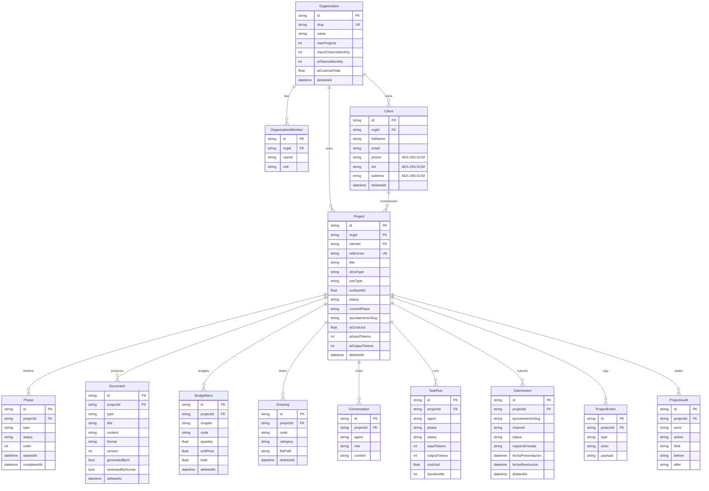

# Esquema de datos — Simvix Obras

Mantenido a mano (sincronizar con `prisma/schema.prisma` en cada PR de
persistencia). Renderiza en GitHub.

## Convenciones

- **Identificadores**: `cuid()` siempre. Reserva `OBRA-YYYY-NNNN` para la
  referencia visible al usuario.
- **Multi-tenant**: `orgId` opcional en Client y Project. Cuando es `null`,
  los servicios resuelven a la organización `default` (auto-creada).
- **Soft-delete**: campo `deletedAt` en Project, Document, BudgetItem,
  Drawing, Submission, Organization. Las queries de lectura por defecto lo
  filtran.
- **PII**: `Client.phone`, `Client.dni`, `Client.address` se almacenan
  cifrados con AES-256-GCM (`enc:v1:<b64>`). Ver `src/lib/security/crypto.ts`.
- **Enums** modelados como `String` + uniones TS para portabilidad entre
  SQLite y Postgres.

## Cambios futuros

Cualquier ALTER que añada columnas debe seguir el patrón:

1. Añadir columna como nullable + valor por defecto.
2. Backfill con script `prisma/scripts/backfill-*.ts`.
3. (Opcional) Una PR posterior la marca NOT NULL si la organización lo
   requiere.

Migraciones nunca destructivas en producción.
